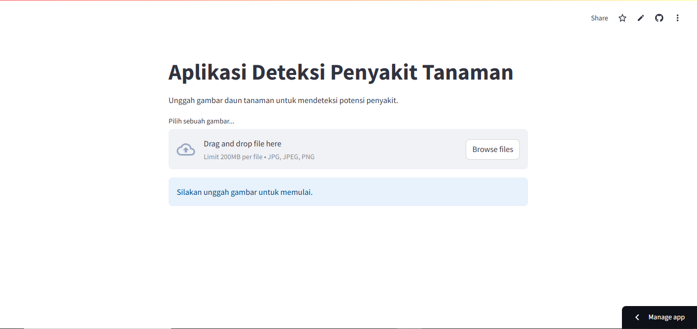
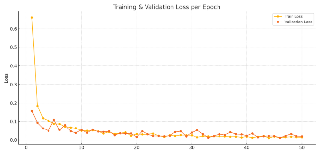
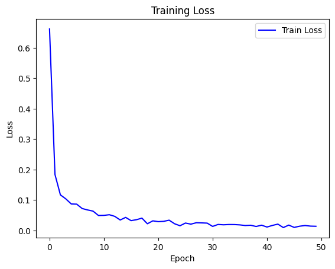
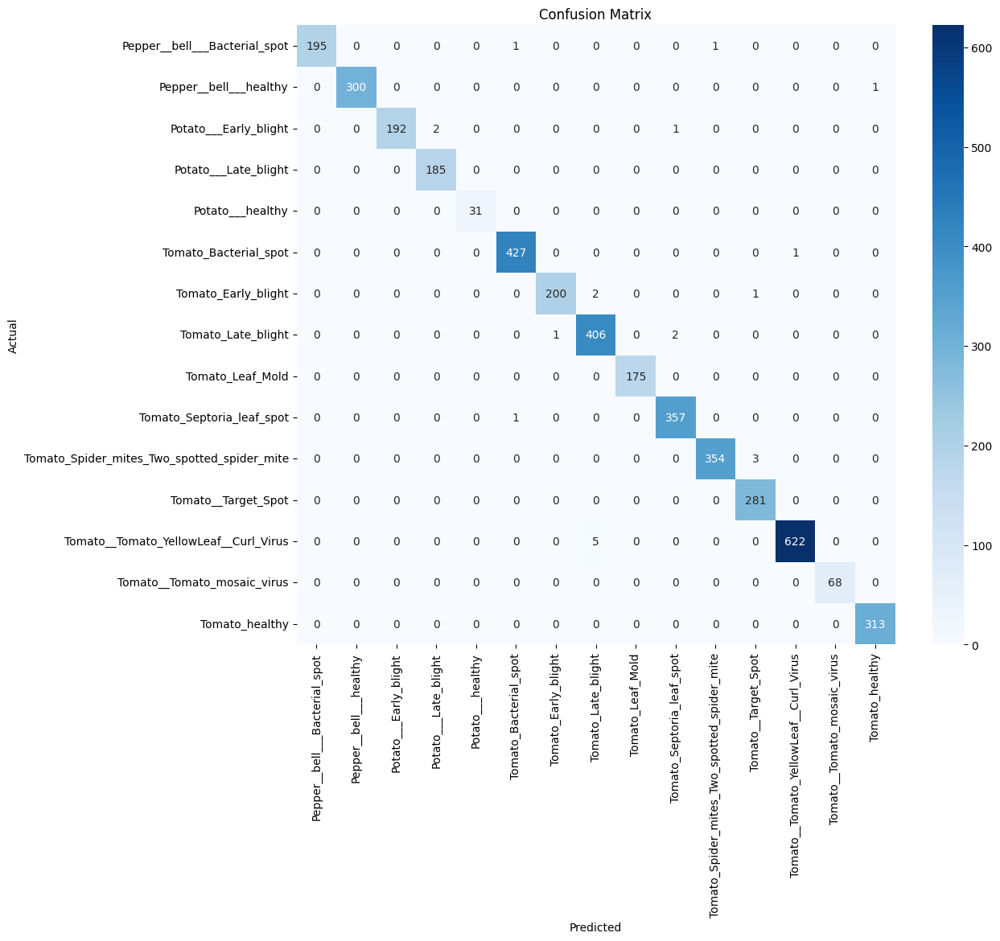

🌿 Deteksi Penyakit Daun Tanaman dengan MobileNetV4 dan Streamlit
Proyek ini bertujuan untuk mendeteksi dan mengklasifikasikan penyakit pada daun tanaman menggunakan model deep learning berbasis MobileNetV4. Model dilatih menggunakan dataset PlantVillage dan diimplementasikan dalam antarmuka pengguna interaktif menggunakan Streamlit.

🚀 Fitur
Deteksi penyakit daun tanaman dari gambar.

Klasifikasi ke dalam beberapa kategori penyakit.

Tampilan hasil prediksi langsung di web app (Streamlit).

Visualisasi training loss dan confusion matrix.

Dapat dijalankan secara lokal 

🧠 Model
Arsitektur: MobileNetV4

Dataset: PlantVillage

Pelatihan dilakukan di: Google Colab

🛠️ Instalasi dan Menjalankan Aplikasi
1. Clone Repository
git clone https://github.com/titoariffianto/Deteksi-Penyakit-Daun-MobileNetV4.git
cd Deteksi-Penyakit-Daun-MobileNetV4

2. Install Dependency
pip install -r requirements.txt

3. Jalankan Aplikasi
streamlit run app.py

### 📸 Tampilan Website

### 📊 Hasil Pelatihan

### 📊 Grafik Training Loss

### 📈 Confusion Matrix

